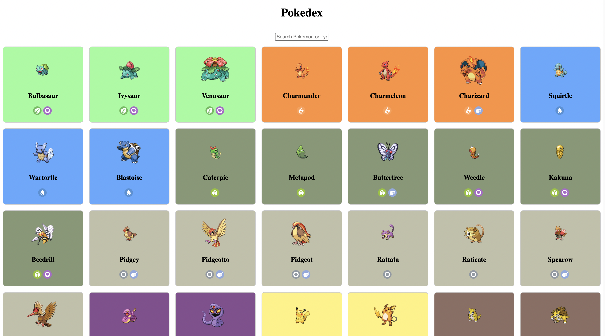
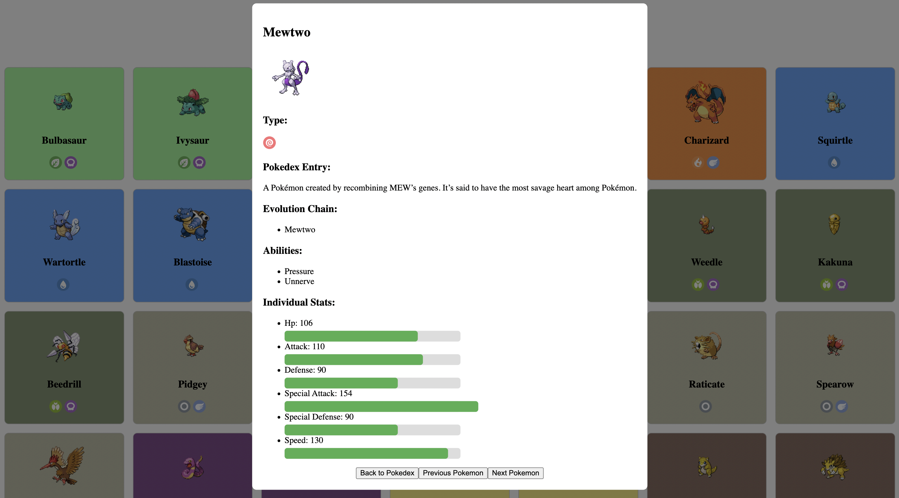
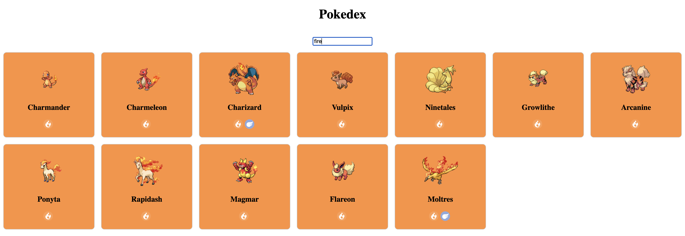

# Pokedex

## Features

- **Explore Pokemon:** Browse through a list of Pokemon with detailed information, including images and types.
- **Search Functionality:** Easily search for specific Pokemon by name or type.
- **Detailed Pokemon View:** Click on a Pokemon to access in-depth details such as abilities, stats, and more.
  

npm install
npm start and visit localhost:3000

## Technologies Used
- **React:** 
- **CSS:**
- **Pokemon API:** 
This project was mainly focused around CSS and API calls,
able to call all the pokemon but editted down to just 151 to reduce load times.

